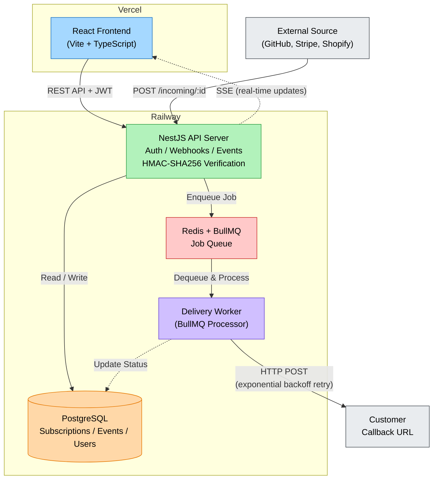

# WebhookHub - Backend

A production-ready webhook management platform built with NestJS. Allows users to subscribe to webhooks from external services, receive events, and reliably deliver them to callback URLs with automatic retries.

**Live Backend:** https://webhook-platform-backend-production.up.railway.app/api  
**Live Frontend:** https://webhook-platform-frontend.vercel.app  
**Queue Dashboard:** https://webhook-platform-backend-production.up.railway.app/admin/queues

---

## System Design



**Flow:**
1. External source (GitHub, Stripe, etc.) sends a webhook POST to `/api/webhooks/incoming/:id`
2. API server verifies HMAC-SHA256 signature, applies event type filtering, and stores the event in PostgreSQL
3. A delivery job is enqueued into BullMQ (backed by Redis)
4. The Delivery Worker picks up the job and POSTs the payload to the subscriber's callback URL
5. On failure, BullMQ retries with exponential backoff (3s, 9s, 27s, 81s, 243s -- up to 5 attempts)
6. Frontend receives real-time status updates via Server-Sent Events (SSE)

---

## Tech Stack

| Layer | Technology |
|-------|-----------|
| Framework | NestJS 11 (Express) |
| Database | PostgreSQL + TypeORM |
| Queue | BullMQ + Redis |
| Auth | JWT (Passport) |
| Security | HMAC-SHA256 webhook signature verification |
| Real-time | Server-Sent Events (SSE) |
| Queue UI | Bull Board |

---

## Design Choices & Architecture

### Why BullMQ + Redis over RabbitMQ/Kafka?
BullMQ provides reliable job processing with built-in retry strategies, backoff, and job persistence -- all backed by Redis. For a webhook delivery system, this is the right level of complexity. Kafka/RabbitMQ would add operational overhead without meaningful benefit at this scale.

### Why SSE over WebSockets?
Server-Sent Events are unidirectional (server to client), which is exactly what we need for live event status updates. SSE is simpler than WebSockets, works over standard HTTP, auto-reconnects natively in browsers, and doesn't require a separate protocol upgrade.

### Why HMAC-SHA256 Signing?
Every subscription gets a unique secret. When the platform delivers an event to a callback URL, it signs the payload with HMAC-SHA256. The subscriber can verify the signature to ensure the request genuinely came from WebhookHub. This is the same approach used by GitHub, Stripe, and Shopify.

### Retry Strategy
Failed deliveries use exponential backoff: `delay = 3^attempt` seconds (3s, 9s, 27s, 81s, 243s). After 5 failed attempts, the event is marked as permanently FAILED. Users can manually retry failed events from the dashboard, which creates a fresh delivery job.

### Event Filtering
Subscriptions can optionally specify allowed event types (e.g., `push`, `payment.succeeded`). Events not matching the filter are silently dropped at ingestion. The event type is read from standard headers (`x-github-event`, `x-event-type`, `x-hook-event`).

### Global Exception Filter
A custom `GlobalExceptionFilter` ensures all API errors return a consistent JSON shape regardless of where the error originates (validation, auth, database, etc).

---

## API Endpoints

### Auth
| Method | Endpoint | Description | Auth |
|--------|----------|-------------|------|
| POST | `/api/auth/register` | Register a new user | No |
| POST | `/api/auth/login` | Login, returns JWT | No |
| GET | `/api/auth/me` | Get current user | JWT |

### Webhooks
| Method | Endpoint | Description | Auth |
|--------|----------|-------------|------|
| POST | `/api/webhooks/subscribe` | Create a subscription | JWT |
| GET | `/api/webhooks` | List all subscriptions | JWT |
| GET | `/api/webhooks/:id` | Get subscription details | JWT |
| PATCH | `/api/webhooks/:id/cancel` | Cancel a subscription | JWT |
| DELETE | `/api/webhooks/:id` | Delete subscription + events | JWT |

### Events
| Method | Endpoint | Description | Auth |
|--------|----------|-------------|------|
| POST | `/api/webhooks/incoming/:id` | Receive webhook from external source | Public |
| GET | `/api/webhooks/:subId/events` | List events (paginated) | JWT |
| GET | `/api/webhooks/:subId/events/:eventId` | Get event details | JWT |
| POST | `/api/webhooks/:subId/events/:eventId/retry` | Manually retry a failed event | JWT |
| GET | `/api/webhooks/:subId/events/stream` | SSE stream for real-time updates | JWT (query param) |
| GET | `/api/webhooks/:subId/stats` | Delivery statistics | JWT |

### Example: Send a webhook

```bash
curl -X POST http://localhost:3000/api/webhooks/incoming/<subscription-id> \
  -H "Content-Type: application/json" \
  -H "x-event-type: payment.succeeded" \
  -d '{"amount": 2999, "currency": "INR", "customer": "alice@example.com"}'
```

---

## Local Setup

### Prerequisites
- Node.js 18+
- PostgreSQL
- Redis

### 1. Clone and install

```bash
git clone https://github.com/Dhruv-Gupta01/webhook-platform-backend.git
cd webhook-platform-backend
npm install
```

### 2. Configure environment

```bash
cp .env.example .env
```

Edit `.env` with your local credentials:

```env
DATABASE_HOST=localhost
DATABASE_PORT=5432
DATABASE_USER=webhook_user
DATABASE_PASSWORD=webhook_pass
DATABASE_NAME=webhook_db

JWT_SECRET=super-secret-change-me-in-production-min-32-chars
JWT_EXPIRES_IN=7d

PORT=3000
APP_URL=http://localhost:3000

REDIS_HOST=localhost
REDIS_PORT=6379
```

### 3. Start PostgreSQL and Redis

Using Docker (recommended):

```bash
docker run -d --name webhook-postgres -p 5432:5432 \
  -e POSTGRES_USER=webhook_user \
  -e POSTGRES_PASSWORD=webhook_pass \
  -e POSTGRES_DB=webhook_db \
  postgres:16

docker run -d --name webhook-redis -p 6379:6379 redis:7
```

### 4. Run the server

```bash
npm run start:dev
```

Server starts at `http://localhost:3000/api` and Bull Board at `http://localhost:3000/admin/queues`.

---

## Webhook Simulator

A standalone script to test the full flow end-to-end:

```bash
node simulate.js <subscriptionId> <signingSecret>
```

This script:
1. Starts a local receiver server on port 4000 (acts as your callback URL)
2. Sends 5 HMAC-signed webhook events (Stripe, GitHub, Shopify, etc.) to the platform
3. Shows real-time logs of forwarded events received at the callback

For testing against the deployed version:

```bash
PLATFORM_URL=https://webhook-platform-backend-production.up.railway.app node simulate.js <subscriptionId> <secret>
```

---

## Project Structure

```
src/
  auth/            # JWT authentication (register, login, guards)
  users/           # User entity and service
  webhooks/
    entities/       # WebhookSubscription, WebhookEvent (TypeORM)
    dto/            # Validation DTOs (class-validator)
    webhooks.*      # Subscription CRUD
    events.*        # Event ingestion, listing, retry, SSE streaming
    delivery.*      # BullMQ processor -- delivers to callback URLs
  common/
    filters/        # Global exception filter
    decorators/     # @CurrentUser, @RawBody
```

---

## Related

- **Frontend repo:** https://github.com/Dhruv-Gupta01/webhook-platform-frontend
